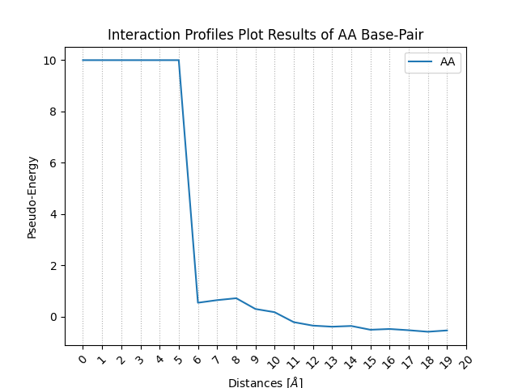
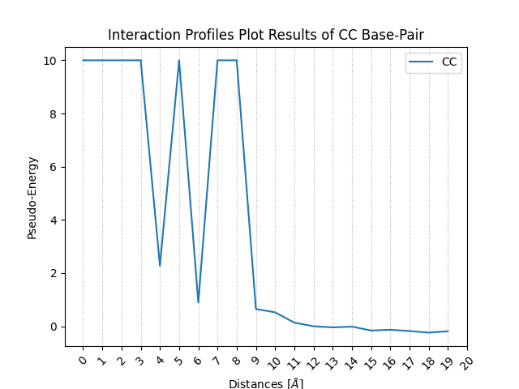
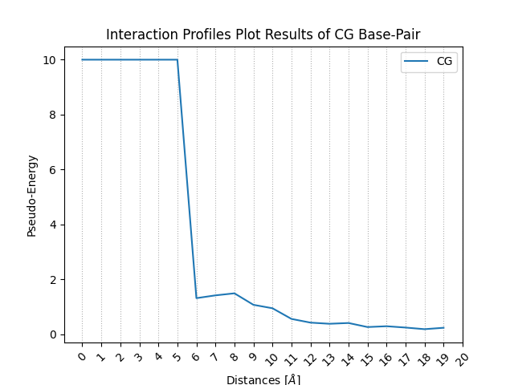
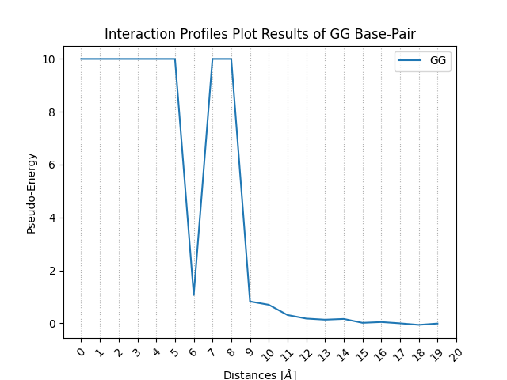
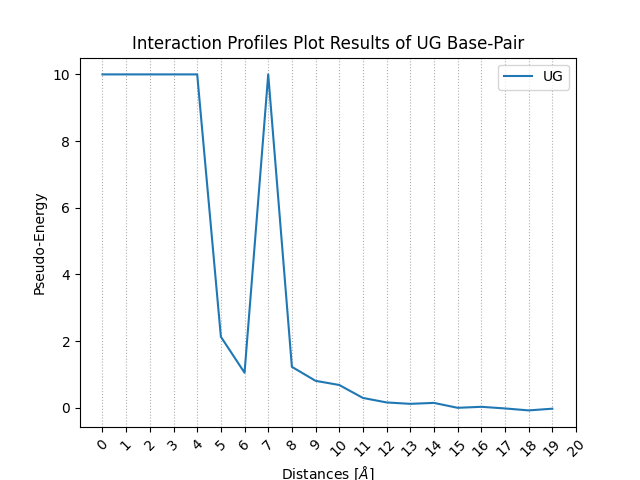
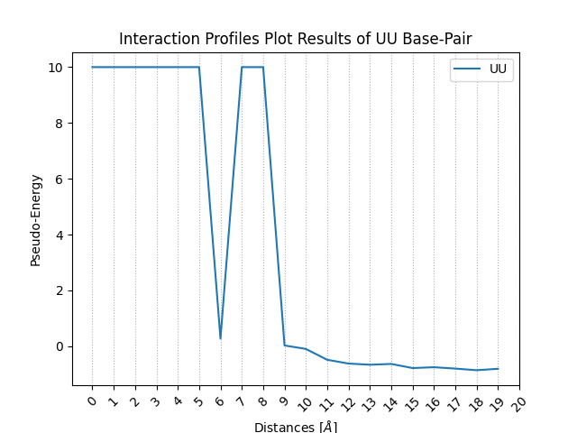

# RNA Folding Energy Estimator

For a given ribonucleotide chain, the RNA folding problem consists in finding the native fold among the astronomically large number of possible conformations. The native fold being the one with the lowest Gibbs free energy, the objective function should be an estimator of this energy.

## Features

The application is composed of four main modules which are detailed below. These modules are: (i) Files Manager & Data Preparation Script, (ii) Training Script, (iii) Scoring Profiles Plot Script and (iv) Predicted Structures Evaluation script.

### Files Manager & Data Preparation Script

- Download the `PDB` files automatically using the sequence reference (_e.g. 1A1T, 8D2A ...etc._)
- Copy `PDB` files from a source directory to a destination one
- Folders cleaner to ensure the good folding energy calculations
- Check if the structure is RNA or not
- Get the list of available `PDB` files for the analysis within a starting directory

### Training Script

This script trains the objective function, using interatomic distance distributions that are computed from a dataset of known 3D structures (i.e. experimentally determined)

- Get the number of models for each RNA `PDB` file
- Compute interatomic distances from the given dataset of PDB files
  - Only C3' atoms are taken into account
  - 10 distance distributions, for the 10 base pairs (AA, AU, AC, AG, UU, UC, UG, CC, CG, GG)
  - Only "intrachain" distances are considered
  - Only consider residues separated by at least 3 positions on the sequence (_i.e. residues i and i+4, i and i+5, etc._)
  - Compute the observed frequencies: 10 × 20 distances intervals (0 to 20 Å)
  - Compute the reference frequency (= the "XX" pair)
  - Compute the log-ratio of the two frequencies

### Interaction Profiles Plot Script

This script uses [matplotlib](https://matplotlib.org/) library to plot the interaction profiles: the score as a function of the distance.

- The pseudo-energy as function of distances is generated for each base pair
- The plot images are saved under the `plot` directory (user can change the default directory)

### Predicted Structures Evaluation Script

This script is partially similar to the training one, as it will compute all the distances for a given structure (same thresholds: 20 A and i, i+4). For each distance, a scoring value will be computed, using a linear interpolation. By summing all these scores, the script will calculate the estimated Gibbs free energy of the evaluated RNA conformation.

- Distance calculation performed by importing functions from the training script
- New score calculation function developed specifically for the evaluation part

## Installation

To clone and run this application, you'll need [Git](https://git-scm.com/) and [Python](https://www.python.org/) (which comes with `pip`) installed on your computer. From your command line, run the following commands:

1. Clone the repo

   ```
   git clone https://github.com/assia-hub/RNA-Folding-Function.git
   ```

1. Change to the cloned directory

   ```
   cd rna_folding
   ```

1. Install the requirements using `pip`

   ```
   pip install -r requirements.txt
   ```

   The needed packages are listed below:

   ```
   contourpy==1.0.7
   cycler==0.11.0
   fonttools==4.38.0
   kiwisolver==1.4.4
   matplotlib==3.6.3
   numpy==1.24.1
   packaging==23.0
   pandas==1.5.2
   Pillow==9.4.0
   pyparsing==3.0.9
   python-dateutil==2.8.2
   pytz==2022.7
   six==1.16.0
   wget==3.2
   ```

## Usage

Once dependencies and the package installed, two modes are allowed: (i) _interactive_ or (ii) _command_. The following instructions explain how each one of them can be used. The terminal is used for the two modes.

### Interactive Mode

1. Run the `main.py` file

   ```
   python main.py
   ```

   If everything is OK, you should get:

   ```
   Welcome to the RNA Folding Energy Estimator 1.0.0. Created by Assia B.

   Before starting, do you want to clean previous data?
   Please enter [1] for YES or [2] for NO:
   ```

1. Select one of the available choices. `[1]` will erase all previous files and directories and start from the scratch or `[2]` to run the code without deleting the initial files

1. Whatever your choice, you'll get the following choices

   ```
   Please indicate how you would like to select the PDB files?
   The PDF files can be selected by:
   [1] - Indicating the sequence reference
   [2] - Indicating a file containing a list of sequences references
   [3] - Indicating a directory containing PDB files
   [4] - Just continue using previous files
   [5] - Stop the program and quit

   Please enter your choice and press enter:
   ```

1. `[1]`, `[2]` and `[3]` cases will get `PDB` file from the source and store it inside the `PDB` directory. `[4]` will just continue running the code without importing new `PDB` files and `[5]` allows you to stop and quit the program

   - If `[1]` is selected, just enter the sequence ID (usually four digits)

     ```
     Please enter the SEQ REF and press enter (e.g. 1ATW):
     ```

   - If `[2]` is selected, the program will ask you to give the `txt` file including the list of sequences.

     ```
     Please enter the path to the file including the list of PDB files to be downloaded or just press enter for the default file (pdb_list.txt):
     ```

     You can just press enter to use the default list `pdb_list.txt`. This list can be modified before running the code.

     ```txt
      101D
      108D
      124D
      165D
      1AJF
      1AJT
      1AL5
      1AQ3
      1AQ4
      1AQO
      4GXY
      4P5J
     ```

   - If `[3]` is selected, the code will copy all `PDB` files to the `PDB` directory

     ```
     Please enter the path to the directory including the PDB files to be copied or just press enter to use the default directory (pdb_files):
     ```

     Instead of giving a directory source, you can just press _Enter_ and the code will use the default one (`pdb_files`), you have therefore to put your files inside before running the code

1. The code will generate automatically a list of all available structures and a second list including RNA structures only (see example bellow)

   ```
   The following structures are available for analysis: ['101D', '108D', '124D', '165D', '1AJF', '1AJT', '1AL5', '1AQ3', '1AQ4', '1AQO', '4GXY', '4P5J']
   The RNA ones (which will be used) are: ['1AJF', '1AJT', '1AL5', '1AQO', '4GXY', '4P5J']
   ```

1. The `Training Script` will be then executed for all RNA structures including all models. This script will generate four reports (txt files) and save them within the `reports` directory:

   - `distances.txt` for the distances
   - `obs_freq.txt` for the observed frequency
   - `ref_freq.txt` for the reference frequency
   - `log_ratio.txt` for the log ratio

1. The `Plot Script` will be automatically executed once all reports generated. The results are saved as a `.png` files within the plot directory.
   
   
   
   
   
   
   
   
   
   

### Command Line Mode

the command line version is working exactly like the main (interactive) version. However, in this case, you should use the `cmain.py` file instead of `main.py`, and all details must be introduced using the `-` and/or `--` options as detailed bellow:

1. To run the code on one specific RNA you can use

   ```
   python cmain.py -s <SEQREF>
   ```

   or

   ```
   python cmain.py --seq <SEQREF>
   ```

1. Or it can be run on a list of RNA references which is stored on a specific file

   ```
   python cmain.py -l <path/to/file.txt>
   ```

   or

   ```
   python cmain.py --list <path/to/file.txt>
   ```

1. The script will than follow exact similar steps as described on the interactive version:
   - Download the `PDB` files
   - Check the downloaded `PDB` files, and use only RNA for the next actions
   - Prepare the data
   - Run the training script
   - Generate the reports and save them within the `reports` directory
   - Generate plots and save the `png` files within the `plot` directory

## Author

- Benmehdia Assia: Find me on GitHub [@assia-hub](https://github.com/assia-hub)

## License

This project is licensed under the GNU General Public License GPLv3 - see the [gnu.org](https://www.gnu.org/licenses/gpl-3.0.md) website for more details.
